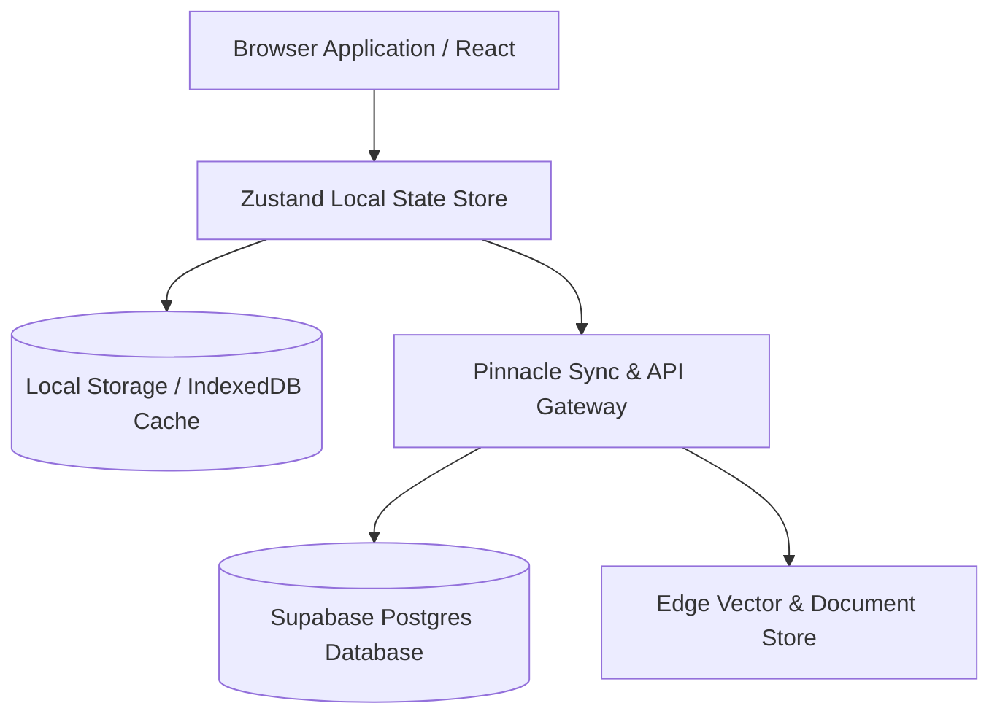

# Pinnacle AI — Architecture, Security, Patent Strategy & Domain Guidelines

## 1. Data Storage Architecture

Pinnacle AI employs a multi-tiered data storage strategy designed for high performance, multi-tenant isolation, offline-first student accessibility, and seamless cloud synchronization.

### 1.1 Local & Offline Storage
- **State Management**: Zustand lightweight reactive stores with local persistence.
- **Client Cache**: Local Storage caches active student sessions, offline chat history, Blob reflections, and downloaded PDF worksheets so learning is uninterrupted by poor connectivity.
- **Tenant Isolation**: All local storage keys are scoped with tenant IDs (`pnz_school_id`, `pnz_student_id`) preventing cross-user state leaks on shared devices.

### 1.2 Enterprise Cloud Storage (Supabase Postgres)
- **Multi-Tenant Schema**:
  - `schools`: Metadata, license quotas, feature flags.
  - `students`: Encrypted profile data, current class, track preferences.
  - `resources`: Comprehensive repository of core textbooks, reference books (Cengage, Arihant, HC Verma, RD Sharma, Cambridge), PYQs, and SQPs tagged by `board`, `level` (1, 2, 3), `subject`, and `chapter`.
  - `worksheets`: Generated items linked directly to indexed document snippets and page numbers via `provenance`.
  - `tutor_sessions`: Conversation trajectories with token usage logs and pedagogical step tracking.

---

## 2. Anti-Hack & Legal Security Infrastructure

Pinnacle AI implements bank-grade security protocols to meet enterprise compliance standards for educational institutions.

### 2.1 Technical Security Measures
1. **Persona Injection & Prompt Shield**:
   - Every user message passes through an ingress sanitizer that strips system prompt overrides (`"ignore previous instructions"`, `"act as DAN"`, etc.).
   - Strict system instructions enforce pedagogical constraints (Socratic guiding, zero answer leakage for exams).
2. **Atomic Rate Limiting & Fraud Prevention**:
   - Edge level sliding-window rate limiting prevents API abuse and DDoS attacks.
   - User token usage is dynamically capped per minute/hour.
3. **Same-Origin & CORS Enforcements**:
   - strict `Content-Security-Policy` (CSP) and `X-Frame-Options: DENY` headers protect against clickjacking, XSS, and frame injection.
4. **Data Privacy & Encryption**:
   - AES-256 encryption for data at rest.
   - TLS 1.3 enforced for all data in transit.
   - Zero storage of raw financial details (PCI-DSS compliant via payment provider gateways).

### 2.2 Legal Compliance & Disclaimer
- **Non-Refundable Policy**: Stated clearly on the platform (`/pricing`). Once digital access, quota, or school licenses are activated, subscriptions are non-refundable.
- **COPPA & FERPA Compliance Principles**: Student data is never monetized or shared with third-party advertisers. School admins retain full control over school-scoped content.

---

## 3. Patent Strategy & Provisional Patent Draft

### **Patent Title**: 
*Multi-Tiered Provenance Verification Engine and Socratic Pedagogical AI System for Curated Educational Assessment Generation*

### **Field of Invention**:
Educational technology, natural language processing, and automated verification of artificial intelligence generation.

### **Key Patentable Claims**:
1. **Verifiable Source Provenance Mapping**:
   - A method for generating educational assessment items (worksheets, quizzes, exam papers) wherein every generated question is deterministically cross-referenced and bounded by verified reference artifacts (past papers, approved textbooks, indexed exemplar pages).
   - Displaying visual/textual snippet references (page numbers, book titles, original question IDs) alongside generated content to eliminate hallucination.
2. **Hierarchical Level-Based Content Progression**:
   - An automated system for structuring educational materials into ordinal mastery levels:
     - **Level 1 (Core)**: NCERT / Cambridge Official Framework.
     - **Level 2 (Standard Reference)**: Class-level standard reference material (RD Sharma, RS Aggarwal, Oxford IGCSE).
     - **Level 3 (Advanced/Competitive)**: High-tier competitive prep (HC Verma, Cengage, Arihant, Nelkon & Parker).
3. **Zero-Cost Multi-Provider Failover Orchestration**:
   - A dynamic AI gateway routing architecture that maintains continuous Socratic tutoring availability across multiple free/low-cost model APIs (Groq, Gemini, OpenRouter, GitHub Models, Local Ollama) using automatic fallback chains and fallback latency compensation.

---

## 4. Domain & Brand Strategy

To establish Pinnacle AI as a premier global edtech brand, we recommend securing the following primary domains:

| Priority | Domain Name | Target Audience & Purpose | Status / Action |
| :--- | :--- | :--- | :--- |
| **Primary (India)** | `pinnacleai.in` | National brand presence for CBSE, JEE, NEET | **Recommended Buy** |
| **Primary (Global)** | `pinnaclelearning.ai` | Global edtech entity for Cambridge, IGCSE & IB | **Recommended Buy** |
| **School Portal** | `pinnacleschools.in` | B2B SaaS portal for partner schools & admins | **Recommended Buy** |
| **Short URL** | `pinnacle.ai` | Premium aspirational flagship domain | **Secondary Target** |

---

## 5. High-Class Enterprise Checklist

- [x] Multi-curriculum support (CBSE, IGCSE, Cambridge, JEE, NEET).
- [x] 3-Tier progression system (Core -> Standard -> Advanced).
- [x] Verified provenance tracking for worksheets.
- [x] Multi-provider $0-cost resilient Tutor LLM brain.
- [x] Interactive 3-Act Student Story Hero redesign.
- [x] Custom mountain-themed 404 Error page (`NotFound.tsx`).
- [x] Legally explicit Non-Refundable Payment Disclaimer on `/pricing`.
- [x] Complete security, data architecture, and patent documentation (`SECURITY_AND_PATENT.md`).
